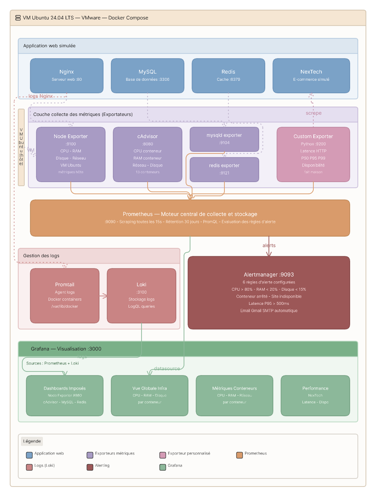
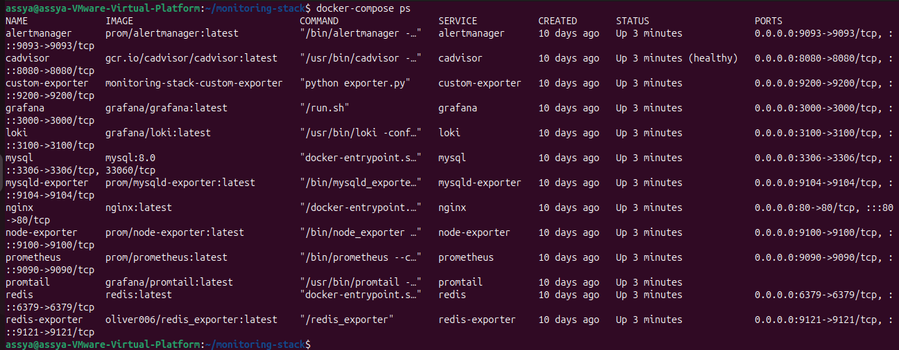
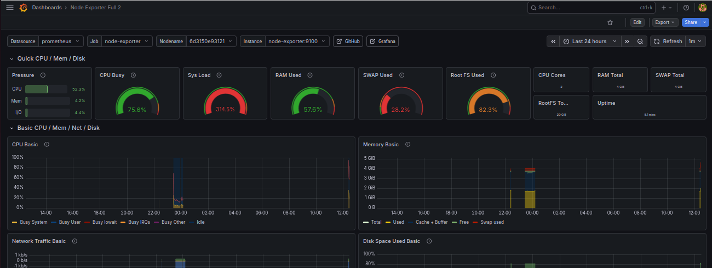
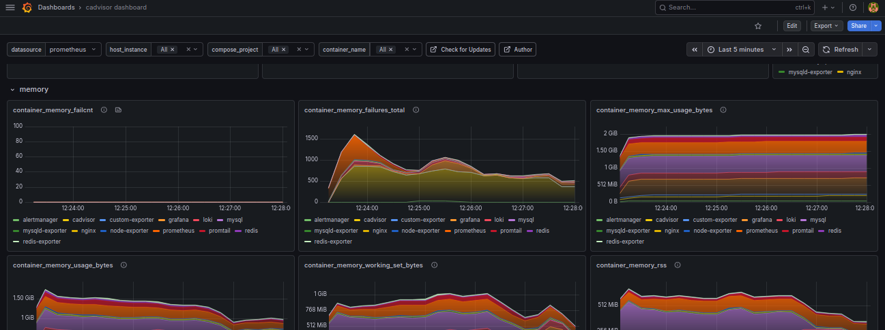
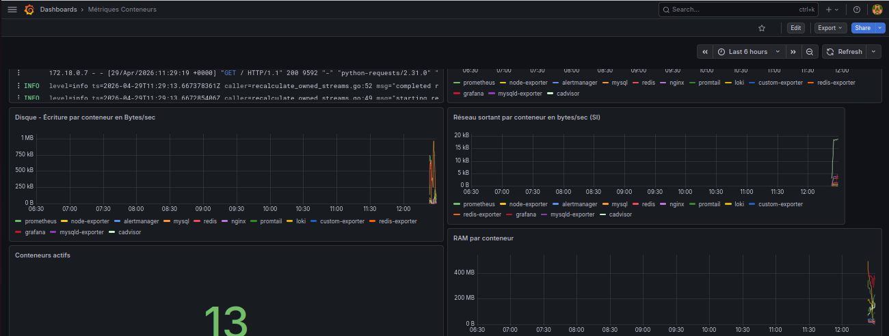
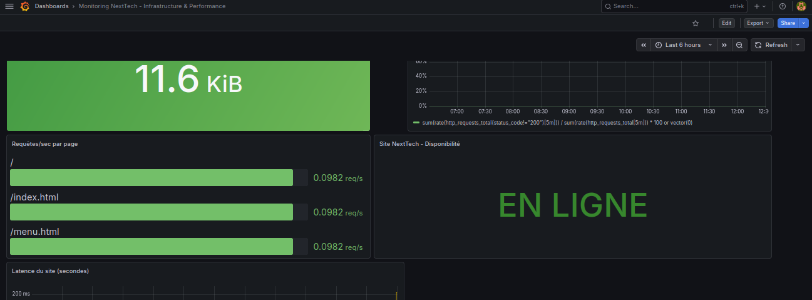
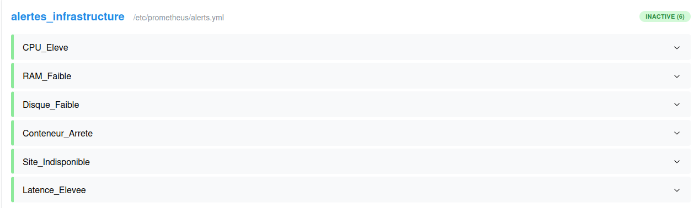
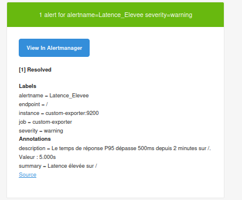

# 🖥️ Advanced Cloud Infrastructure Monitoring & Observability Platform


---

##  Project Overview

A **full-stack observability platform** deployed on an Ubuntu VM, monitoring both the host machine resources and the performance of a simulated web application running in Docker containers.

The platform collects **metrics AND logs**, visualizes everything in Grafana, and sends **automatic email alerts** when critical thresholds are exceeded.

The monitored application is **NexTech** — a simulated e-commerce website selling tech products (laptops, smartphones, TVs, accessories) — deployed with Nginx, MySQL, and Redis to replicate a realistic production environment.

---

##  Architecture

[](images/Architecture.png)

---

##  Tech Stack

| Component | Role | Port |
|-----------|------|------|
| **Prometheus** | Metrics collection & storage (TSDB) | 9090 |
| **Grafana** | Visualization & dashboards | 3000 |
| **Alertmanager** | Alert routing & email notifications | 9093 |
| **Node Exporter** | VM system metrics (CPU, RAM, disk, network) | 9100 |
| **cAdvisor** | Docker container metrics | 8080 |
| **mysqld-exporter** | MySQL database metrics | 9104 |
| **redis-exporter** | Redis cache metrics | 9121 |
| **Custom Python Exporter** | Application-level metrics (latency, availability) | 9200 |
| **Loki** | Log storage & indexing | 3100 |
| **Promtail** | Log collector (Docker → Loki) | — |
| **Nginx** | Web server for NexTech site | 80 |
| **MySQL** | Relational database | 3306 |
| **Redis** | In-memory cache | 6379 |

---

##  Project Structure

```
monitoring-stack/
├── docker-compose.yml              # All services orchestration
├── .env.example                    # Environment variables template
├── .gitignore
│
├── prometheus/
│   ├── prometheus.yml              # Scraping configuration (6 jobs)
│   └── alerts.yml                  # Alert rules (6 alerts)
│
├── alertmanager/
│   └── alertmanager.yml            # SMTP email config (NOT committed to git)
│
├── loki/
│   └── loki-config.yml             # Loki storage configuration
│
├── promtail/
│   └── promtail-config.yml         # Log collection configuration
│
├── custom-exporter/
│   ├── exporter.py                 # Custom Python exporter — main feature
│   ├── requirements.txt            # Python dependencies
│   └── Dockerfile                  # Container image definition
│
└── app/
    ├── index.html                  # NexTech homepage
    ├── menu.html                   # Product catalog page
    └── style.css                   # Stylesheet
```

---

##  Prerequisites

- Ubuntu 22.04 LTS or Debian 12
- Docker Engine 24+
- Docker Compose v2+
- Minimum 4 GB RAM
- Minimum 20 GB disk space

---

##  Getting Started

### 1. Clone the repository

```bash
git clone https://github.com/AssyaELM/Monitoring-Infrastructure-Cloud.git
cd monitoring-stack
```

### 2. Configure environment variables

```bash
cp .env.example .env
nano .env
```

Fill in your values:

```env
GRAFANA_PASSWORD=your_secure_password
MYSQL_ROOT_PASSWORD=your_mysql_password
MYSQL_USER=root
MYSQL_PASSWORD=your_mysql_password
SMTP_EMAIL=your-email@gmail.com
SMTP_PASSWORD=your_gmail_app_password
```

> **Important**: To generate a Gmail App Password, go to:
> Google Account → Security → 2-Step Verification → App Passwords

### 3. Configure Alertmanager email

Create this file (excluded from git for security):

```bash
nano alertmanager/alertmanager.yml
```

```yaml
global:
  resolve_timeout: 5m
  smtp_smarthost: 'smtp.gmail.com:587'
  smtp_from: 'your-email@gmail.com'
  smtp_auth_username: 'your-email@gmail.com'
  smtp_auth_password: 'your-app-password'
  smtp_require_tls: true

route:
  group_by: ['alertname', 'severity']
  group_wait: 30s
  group_interval: 5m
  repeat_interval: 4h
  receiver: 'email-alert'

receivers:
  - name: 'email-alert'
    email_configs:
      - to: 'your-email@gmail.com'
        send_resolved: true
        subject: '[ALERT] {{ .GroupLabels.alertname }}'
        body: |
          {{ range .Alerts }}
          Alert: {{ .Annotations.summary }}
          Detail: {{ .Annotations.description }}
          Severity: {{ .Labels.severity }}
          {{ end }}

inhibit_rules: []
```

### 4. Start all services

```bash
docker-compose up -d
```

### 5. Verify everything is running

```bash
docker-compose ps
```

All 13 containers should show `Up` status.


---

##  Access the Interfaces

| Interface | URL | Credentials |
|-----------|-----|-------------|
| NexTech Website | http://localhost | — |
| Grafana | http://localhost:3000 | admin / your_password |
| Prometheus | http://localhost:9090 | — |
| Prometheus Targets | http://localhost:9090/targets | All green = healthy |
| Prometheus Alerts | http://localhost:9090/alerts | 6 rules configured |
| Alertmanager | http://localhost:9093 | — |
| Custom Exporter | http://localhost:9200/metrics | Raw metrics |

---

##  Grafana Dashboards

### Imported Dashboards

| Dashboard | Grafana ID | Description |
|-----------|-----------|-------------|
| Node Exporter Full | **1860** | Complete Ubuntu VM metrics |
| cAdvisor | **19792** | Docker container metrics |
| MySQL | **14057** | Database performance metrics |
| Redis | **763** | Cache performance metrics |



### Custom Dashboards (built from scratch with PromQL)

#### Dashboard 1 — Container Metrics NexTech

| Panel | PromQL Query |
|-------|-------------|
| CPU per container | `rate(container_cpu_usage_seconds_total{name!=""}[2m]) * 100` |
| RAM per container | `container_memory_usage_bytes{name!=""}` |
| Inbound network | `rate(container_network_receive_bytes_total{name!=""}[2m])` |
| Outbound network | `rate(container_network_transmit_bytes_total{name!=""}[2m])` |
| Disk read | `rate(container_fs_reads_bytes_total{name!=""}[2m])` |
| Disk write | `rate(container_fs_writes_bytes_total{name!=""}[2m])` |
| Active containers | `count(container_last_seen{name!=""})` |


#### Dashboard 2 — NexTech Site Performance

Powered **exclusively** by the custom Python exporter:

| Panel | PromQL Query |
|-------|-------------|
| Site availability | `site_availability_up` |
| Latency P50/P95/P99 | `histogram_quantile(0.95, rate(http_request_duration_seconds_bucket[5m]))` |
| Error rate | `sum(rate(http_requests_total{status_code!="200"}[5m])) / sum(rate(http_requests_total[5m])) * 100 or vector(0)` |
| Requests per second | `rate(http_requests_total[5m])` |
| Response size | `http_content_size_bytes` |

---

##  Custom Python Exporter — Key Feature

The custom Python exporter is the **main original contribution** of this project. Unlike cAdvisor which monitors container resources internally, the Python exporter acts as a **virtual user** probing the NexTech website every 10 seconds to measure real user experience.

### cAdvisor vs Python Exporter

| Capability | cAdvisor | Python Exporter |
|------------|----------|-----------------|
| Container CPU usage | ✅ Yes | ❌ No |
| Container RAM usage | ✅ Yes | ❌ No |
| HTTP response time | ❌ No | ✅ Yes |
| Site availability check | ❌ No | ✅ Yes |
| P95 / P99 latency | ❌ No | ✅ Yes |
| HTTP status codes (200/404/500) | ❌ No | ✅ Yes |
| Per-page performance | ❌ No | ✅ Yes |

### Exposed Metrics

| Metric | Type | Description |
|--------|------|-------------|
| `http_request_duration_seconds` | Histogram | HTTP latency per page (enables P50/P95/P99) |
| `http_requests_total` | Counter | Total requests by endpoint and status code |
| `site_availability_up` | Gauge | Availability: 1=UP, 0=DOWN |
| `http_content_size_bytes` | Gauge | Response size per page in bytes |

### Monitored Endpoints

- `/` — Homepage
- `/index.html` — Homepage alias
- `/menu.html` — Product catalog

### How It Works

```
Every 10 seconds:
    For each monitored page:
        1. Send HTTP GET to Nginx
        2. Measure response duration
        3. Record HTTP status code
        4. Update Prometheus metrics
    → Prometheus scrapes :9200/metrics
```

---

##  Alert Rules

| Alert Name | Trigger Condition | Severity | Duration |
|------------|-------------------|----------|----------|
| `CPU_Eleve` | VM CPU > 80% | ⚠️ Warning | 1 min |
| `RAM_Faible` | Available RAM < 20% | ⚠️ Warning | 1 min |
| `Disque_Faible` | Free disk space < 15% | 🔴 Critical | 1 min |
| `Conteneur_Arrete` | Container unseen > 60s | 🔴 Critical | 30s |
| `Site_Indisponible` | `site_availability_up == 0` | 🔴 Critical | 30s |
| `Latence_Elevee` | P95 latency > 500ms | ⚠️ Warning | 2 min |

Every triggered alert sends an **automatic email** via Alertmanager with the alert name, affected instance, current value, and detailed description.


---

##  Log Management (Loki + Promtail)

### How It Works

```
Docker Containers
      │  (stdout/stderr logs)
      ▼
   Promtail
   (reads /var/lib/docker/containers/*/*-json.log)
      │  (ships with labels: job, container_name)
      ▼
    Loki
   (stores indexed logs — labels only, not content)
      │
      ▼
   Grafana Explore
   (query with LogQL, correlate with metrics)
```

### Useful LogQL Queries

```logql
# All container logs
{job="docker"}

# Nginx access logs
{container_name="nginx"}

# Filter 404 errors only
{container_name="nginx"} |= "404"

# All errors across all containers
{job="docker"} |= "error"

# Logs during CPU stress test
{job="docker"} |= "warn"

# Custom Python exporter logs
{container_name="custom-exporter"}

# ApacheBench load test traffic
{job="docker"} |= "ApacheBench"

# MySQL logs
{container_name="mysql"}
```

### Metrics/Logs Correlation

- **Data Links**: Click on any metrics spike → automatically opens Loki logs for the same time period
- **Annotations**: Red vertical lines appear on graphs at moments when errors occur in logs
- **Split View**: Side-by-side Prometheus metrics (left) + Loki logs (right) with synchronized time range

---

##  Load Testing & Validation

### Install testing tools

```bash
sudo apt install -y stress-ng apache2-utils
```

### CPU stress test → triggers CPU_Eleve alert

```bash
stress-ng --cpu 2 --timeout 120s
```

Watch in Grafana: CPU rises → alert turns yellow (Pending) → turns red (Firing) → email received.

### RAM stress test → triggers RAM_Faible alert

```bash
stress-ng --vm 2 --vm-bytes 90% --timeout 120s
```

### HTTP load test → observe latency in dashboard

```bash
# 3000 requests, 100 concurrent connections
ab -n 3000 -c 100 http://localhost/
ab -n 500 -c 20 http://localhost/menu.html
```

### Container stop test → triggers Site_Indisponible

```bash
docker-compose stop nginx
# Wait 30s → alert fires → email received
docker-compose start nginx
```

### Container stop test → triggers Conteneur_Arrete

```bash
docker-compose stop redis
# Wait 1 min → alert fires → email received
docker-compose start redis
```

### Generate 404 errors for Loki demo

```bash
curl http://localhost/page-not-found
curl http://localhost/admin
curl http://localhost/test-404
```

---

##  Benchmark Results

| Metric | Value |
|--------|-------|
| Nginx throughput | **622 req/s** |
| P50 latency | **150ms** |
| P95 latency | **263ms** |
| Failed requests | **0** |
| CPU alert email | ✅ Received |
| RAM alert email | ✅ Received |
| Site unavailable alert | ✅ Received in 30s |
| Container stopped alert | ✅ Received |
| Loki logs ingested | ✅ All 13 containers |
| Metrics/logs correlation | ✅ Data Links + Annotations |

---

##  Security Considerations

- Grafana admin password changed from default
- Sensitive ports (9090, 9100, 8080) should not be exposed to the internet
- SMTP authentication uses Gmail App Password (not account password)
- `alertmanager.yml` is excluded from git via `.gitignore`
- `.env` file with credentials is excluded from git
- Prometheus data retention set to **30 days**

---

##  Useful Commands

```bash
# Start all services
docker-compose up -d

# Stop all services
docker-compose down

# Check all containers status
docker-compose ps

# View logs of a specific service
docker logs prometheus 2>&1 | tail -20
docker logs grafana 2>&1 | tail -20
docker logs custom-exporter 2>&1 | tail -20
docker logs alertmanager 2>&1 | tail -20

# Reload Prometheus config without restart
curl -X POST http://localhost:9090/-/reload

# Restart a specific service
docker-compose restart alertmanager
docker-compose restart prometheus

# Check custom exporter is working
curl http://localhost:9200/metrics | grep http_requests_total

# Check Loki is ready
curl http://localhost:3100/ready

# View available Loki labels
curl http://localhost:3100/loki/api/v1/labels

# Rebuild custom exporter after code changes
docker cp custom-exporter/exporter.py custom-exporter:/app/exporter.py
docker-compose restart custom-exporter
```

---

##  Troubleshooting

| Problem | Solution |
|---------|----------|
| Prometheus not accessible on :9090 | `docker logs prometheus` — check for YAML syntax errors |
| Loki keeps restarting | `sudo chown -R 10001:10001 loki/data/` then restart |
| mysqld-exporter restarting | Check MySQL credentials in docker-compose.yml |
| Email alerts not received | `docker logs alertmanager` — verify Gmail App Password |
| Custom exporter shows 404 | Verify pages exist in `app/` directory |
| No data in Grafana panels | Check `http://localhost:9090/targets` — all should be UP |

---

## ✅ Project Checklist

```
✅ 13 Docker containers running simultaneously
✅ 6 Prometheus scrape jobs configured
✅ 6 alert rules with automatic email notifications
✅ 4 imported Grafana dashboards (community)
✅ 2 custom-built Grafana dashboards (PromQL from scratch)
✅ Custom Python exporter (application-level monitoring)
✅ Centralized log management with Loki + Promtail
✅ Metrics/logs correlation via Data Links & Annotations
✅ Load testing validated with stress-ng and Apache Bench
✅ 30-day Prometheus data retention configured
✅ Security: secrets excluded from repository
```

---

## 👤 Author

**Assya**
Cloud Infrastructure & Monitoring — 2026

---

## 📄 License

This project was developed as part of an academic cloud infrastructure course.
Feel free to use it as a reference for your own monitoring projects.

---

> ⭐ **If this project helped you, please give it a star!**
